# Runtime Usage Outbox Boundary

Status date: `2026-09-26`

This boundary provides dormant, source-local PostgreSQL storage for privacy-safe runtime usage components. It
does not collect usage yet, does not contact a managed-service endpoint, and is not billing evidence.

```mermaid
flowchart LR
    Runtime["HTTP/WebSocket/turn seams<br/><b>NOT WIRED</b>"]
    Writer["Typed runtime event writer<br/><b>DORMANT / NOT REGISTERED</b>"]
    Record["RecordRuntimeUsageEvent<br/>identity resolution + exact replay"]
    Binding["HMAC subject binding<br/>managed robot UUID"]
    Accumulator["Daily typed accumulator<br/>monotonic + incomplete sticky"]
    Receipt["Immutable applied event"]
    Schedule["ScheduleRuntimeUsageSnapshot<br/>locked revision + sequence"]
    Message["Immutable typed outbox snapshot"]
    Delivery["Separate delivery state"]
    DeliveryApi["Owner-only claim / defer / acknowledge / quarantine<br/><b>DORMANT</b>"]
    Collector["Private pull collector<br/><b>REMAINING</b>"]
    Assembly["Multi-source Cloud assembly<br/><b>REMAINING</b>"]

    Runtime --> Writer --> Record
    Binding --> Record
    Record --> Accumulator
    Record --> Receipt
    Accumulator --> Schedule
    Schedule --> Message
    Schedule --> Delivery --> DeliveryApi
    Message --> DeliveryApi --> Collector --> Assembly
```

Migration `011_create_runtime_usage_outbox.state.sql` creates five prefixed tables in the configured state
schema. Prefixing preserves the migration runner's isolated-schema integration model while allowing a later
deployment artifact to grant capabilities on only these objects.

The stored component is deliberately typed. It can contain successful/failed turns, bounded HTTP and WebSocket
counts/bytes, and input-audio bytes. There is no arbitrary JSON/blob payload and no column for a device ID,
serial, credential, customer, transcript, prompt, response, audio content, header, or provider payload.
Source identity is a 32-byte HMAC mapped administratively to the managed robot UUID; historical rows freeze the
UUID and bindings can only move from active to revoked.

`RuntimeUsageEvent` and `IRuntimeUsageEventWriter` define the typed application
boundary. `PostgreSqlRuntimeUsageEventWriter` calls the existing state function
with explicit parameter types and a validated, schema-qualified function name.
It is not registered in dependency injection and does not hook robot traffic,
derive identity HMACs, schedule snapshots, or retry automatically. The caller must
retain the same event identity and values on retry. Storage and cancellation
failures propagate to the caller; this primitive is not the serving-side outage
policy. The database remains authoritative for binding resolution and its
35-day historical / five-minute future timestamp acceptance window.
The event constructor truncates sub-microsecond ticks once to PostgreSQL timestamp
precision; retries use that normalized UTC value. Differences below one
microsecond intentionally represent the same event timestamp.

This adapter currently targets the invoker-rights function for controlled tests.
It must not be enabled against live traffic using owner credentials. A narrow
writer wrapper, durable outage handling, and activation tests remain required.

`RecordRuntimeUsageEvent` resolves the binding for the event timestamp, rejects empty/negative deltas, records
the typed event once, detects conflicting reuse of an event UUID, and advances the accumulator in one database
transaction. An incomplete marker is sticky and a complete all-zero accumulator is invalid.

`ScheduleRuntimeUsageSnapshot` locks the accumulator, allocates its next database-owned sequence, copies only
the typed component fields to an immutable outbox row, creates pending delivery state, and advances the
scheduled revision atomically. Repeating a schedule when the revision has not advanced returns the existing
snapshot.

Migration `012_runtime_usage_delivery_boundary.state.sql` adds the dormant owner-only delivery lifecycle.
Claims are bounded, leased with `FOR UPDATE SKIP LOCKED`, and head-of-line ordered per robot/day/environment
stream. Expired leases can be reclaimed. Acknowledgement requires the current live lease and a 32-byte receipt
hash; quarantine requires the current live lease and a bounded category. Terminal replays are idempotent only
when their receipt or category agrees. A quarantined message deliberately blocks later messages in the same
stream so an operator cannot silently skip a source sequence. The migration grants no collector capability and
explicitly revokes `PUBLIC` execution.

Migration `015_runtime_usage_defer_boundary.state.sql` adds bounded source-side backoff without treating a
temporarily incomplete Cloud assembly as success or data loss. Only the current live lease owner can defer a
message, the new not-before time must be strictly future and no more than 24 hours away, and the attempt count
does not change. Each request carries an operation UUID and writes an immutable receipt before the atomic
`leased`-to-`pending` transition. An exact retry remains replayable even if the message later becomes terminal;
reuse of the operation UUID with different inputs is rejected. Deferred head-of-line messages continue to block
later snapshots in the same robot/day/environment stream. The migration also closes the lease-expiry mutation
window in acknowledgement and quarantine by rechecking the lease in their final update predicates. It creates
no roles or grants and remains unwired.

Migration `016_runtime_usage_attempt_cap_recovery.state.sql` adds the dormant, owner-only
`RecoverRuntimeUsageOutboxAtAttemptCap` terminal audited classification operation. Despite its historical
function name, this is not a stream-recovery or unblock operation. It accepts a message ID, a nonzero recovery
operation UUID, and a 32-byte opaque evidence digest. Classification is eligible only at exactly 100,000
attempts and only for a ready pending message or a lease whose expiry has passed. The operation writes an
immutable receipt capturing the operation, evidence, prior delivery state/count/not-before/lease expiry,
database session/current users, recovery timestamp, and fixed `quarantine` / `attempt-cap-exhausted` action
values before atomically quarantining the delivery and clearing its lease. The attempt count is preserved. Exact
retries are successful replays; changed arguments or reuse of an operation UUID for another message fail with
`22023`. Live leases, lower attempt counts, future pending messages, acknowledged messages, and already
quarantined messages are rejected. The receipt and function receive no grants, the function is not `SECURITY
DEFINER`, and the operation remains unwired. A quarantined message intentionally retains its head-of-line
blocking behavior, so later snapshots remain blocked until separately handled.

## Activation Boundary

This migration intentionally grants no runtime, binding-administrator, or collector role. The functions run
with invoker rights and are currently usable only by the database owner. Before activation:

1. add narrowly owned `SECURITY DEFINER` deployment wrappers with a pinned search path and separate roles;
2. add and exercise a narrowly scoped deployment wrapper/collector role for the owner-only delivery functions;
3. add the runtime writer without making customer requests fail solely because metering storage is unavailable;
4. durably mark the affected day incomplete after a source write outage;
5. prove concurrent replica, crash/retry, expired-lease, binding rotation, and least-privilege behavior in CI;
6. add the private collector, durable cloud-side progress store, and shadow reconciliation before enabling any
   final managed-service import.

Application Insights and diagnostic capture remain operational/debugging systems. They are aggregate or
best-effort and must not be parsed into this ledger.

### Ordered activation work

The September 24 controlled staging fixture passed source recording, scheduling,
destination intake, acknowledgment, and two nonempty restricted-reader comparisons.
Those synthetic snapshots were roughly four seconds apart, not a live-traffic soak.
They do not close the following activation gates:

1. A typed writer must preserve the caller's event UUID and exact event values
   across retries. Validation must match the SQL bounds; database failure must not
   be reported as successful recording.
2. A separately reviewed, least-privilege writer wrapper and bounded connection
   pool must replace owner credentials before live traffic is connected.
3. Durable pending-event and outage/gap evidence must survive process restart.
   Serving must remain available during metering failure without silently treating
   affected UTC days as complete. An in-memory queue alone does not meet this gate.
4. Start with finalized speech turns, not every transport seam at once. Define
   success, failure, cancellation, no-input, and suppressed duplicate finalization
   explicitly; the operational `finalizeOutcome` metric is not itself that contract.
   Snapshot audio byte counts before buffers reset. Do not derive a trusted binding
   from an unverified display name or session identifier.
5. Exercise duplicate finalization, crash/retry, binding revocation, midnight UTC,
   and database outage/recovery before explicitly enabling capture in staging.
6. Enable bounded snapshot scheduling and collection separately, then retain
   organic nonempty reconciliation over a representative observation interval.

No step enables charging, changes production, or certifies the proposed fleet size.

## Source delivery deployment artifact

`infra/postgresql/runtime-usage-delivery-role.sql` is a separately reviewed deployment artifact, not a
migration. The administrative provisioner accepts the configured state schema and the exact name of an already
created physical login principal. It fails closed if that principal is missing, privileged, has an unexpected
membership, or crosses the dedicated delivery boundary; it never creates a login, changes a password, or attaches
a secret.

The artifact creates the `runtime_usage_delivery` wrapper schema and two `NOLOGIN` roles: a narrow, non-inheriting
owner and an inheriting capability role. Four pinned `SECURITY DEFINER` wrappers are exposed—claim, defer,
acknowledge, and quarantine. Each wrapper uses `pg_catalog`, the explicitly configured state schema, and `pg_temp`
as its complete search path and calls a schema-qualified state function. The source login receives only the
capability role, wrapper `EXECUTE`, and schema `USAGE`; it receives no table/view/raw-function/owner access.

Attempt-cap recovery is intentionally absent from this artifact. That operation remains an operator-only,
unwired function until a separately reviewed recovery boundary is approved.

## Dormant shadow-source reader

`infra/postgresql/runtime-usage-shadow-source-role.sql` is a separate,
read-only deployment artifact for later Cloud shadow reconciliation. It does
not widen the delivery identity and is not applied by normal migration or
runtime startup. Its pre-created physical login is exactly
`openjibo_runtime_usage_shadow_source` with `LOGIN INHERIT`, no elevated
attributes, and connection limit `1`.

The artifact creates independent `NOLOGIN` owner and capability roles and the
`runtime_usage_shadow_source` wrapper schema. The physical login can execute
only two `STABLE SECURITY DEFINER` functions: `describe_runtime_usage_stream`
captures an immutable stream high watermark and `read_runtime_usage_stream_page`
returns a strictly sequence-keyset page through that caller-supplied fixed
watermark. The page limit is `1..250`, returns the full immutable runtime
snapshot needed to reproduce canonical evidence, and exposes only the minimal
delivery state, delivery observation timestamp, acknowledgement receipt hash,
and quarantine category.

The reader has no direct raw table or function access, no claim/defer/acknowledge/
quarantine/recovery operation, and no access to bindings, events, accumulators,
or credentials. `PUBLIC TEMP`, unexpected memberships, raw ACL contamination,
schema creation, unsafe role attributes, and source-wrapper privilege leakage
fail closed. A later private adapter must hash the returned opaque idempotency
key immediately and must never log or persist it.
